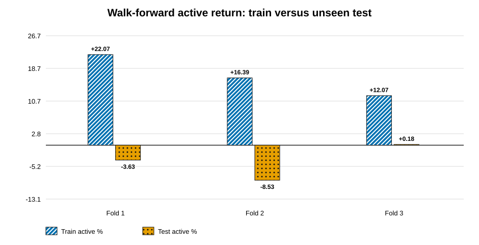
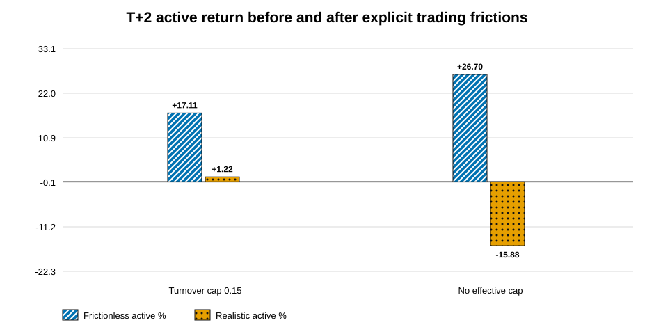
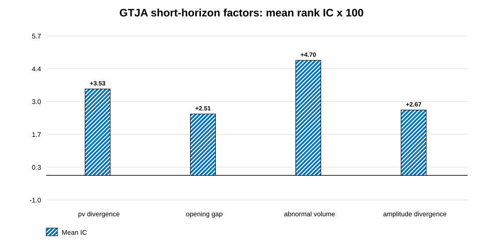

# A股 Point-in-Time 多因子回测框架

[English](README.md) | [中文](README.zh-CN.md)

[](https://github.com/Kenny030501/a-share-pit-multifactor/actions/workflows/ci.yml)

本项目是一套端到端的A股横截面因子研究框架，核心目标是在不提前使用尚未依法披露的财务信息的前提下，对因子、组合构建与样本外表现进行可复现检验。

框架覆盖数据采集、时点一致（Point-in-Time）快照、稳健因子推断、组合构建、换手与容量诊断，以及扩展窗口样本外验证。本项目由达鸿儒独立完成。

## 项目能力

- 对价格、估值数据和财务报表进行Point-in-Time处理，控制未来信息泄露。
- 执行横截面IC/IR检验及分位数组合诊断。
- 在行业和市值中性约束下进行组合优化，并控制换手率。
- 采用Walk-Forward方式选择模型，显式计入交易成本。
- 使用Newey-West方法进行IC推断，计算移动区块Bootstrap置信区间，并通过Benjamini-Hochberg方法控制多重检验的错误发现率。
- 提供换手诊断和可选的资产管理规模感知容量分析，并使用平方根冲击模型估算市场冲击。
- 如实报告负面结果、幸存者偏差和风险模型局限。

## 研究规模

- 覆盖5,527只A股证券。
- 本地研究数据库包含约1,254万条日频价格记录。
- 数据、统计、因子诊断、回测、容量分析、组合优化、样本外验证和测试模块合计约6,300行Python代码。
- 在严格T+2约定下复现并检验短周期价量因子。

## 主要研究结果

- 六类传统因子未通过现实基准检验；在测试设定下，其年化超额收益约为−10%至−12%。
- 自适应Walk-Forward选择器仅在3个折叠中的1个跑赢基准，合并测试窗口相对基准的年化表现为−4.21%。
- 固定价量反转参考策略取得5.62%的年化超额收益和0.87的夏普比率；除非该设定在测试窗口开始前已经冻结，否则这一结果只能作为描述性证据。
- 在换手控制后，严格T+2中性组合相对中证500代理基准取得1.22%的年化净超额收益。

以上结果均为历史研究结果，不代表预期收益，也不构成投资建议。完整证据、方法和限制见[中文项目报告](reports/research/project-report-zh.md)。

## 60秒证据审计

仓库提供无需下载原始数据库即可运行的证据审计。它会根据已提交的结果文件重建核心结论，检查因子显著性、训练期到测试期的表现衰减，以及换手控制的影响。

```bash
make audit
```







完整审计见[量化研究证据审计](reports/audit/quant-research-audit.md)。适合面试讲解的设计选择和证据边界见[量化面试简报](reports/interview/quant-interview-brief.md)。

## 系统架构

```text
AkShare市场/基本面数据 + 基准序列
    -> 可重建缓存与SQLite数据存储
    -> 保守的Point-in-Time快照
    -> 因子构造与横截面IC分析
    -> HAC / 区块Bootstrap / 多重检验审计
    -> 约束组合构建
    -> 显式成本、换手与AUM容量压力测试
    -> 扩展窗口样本外验证
    -> 可复核的证据审计与图表
```

核心实现原则：

- 因子诊断与回测共用同一套Point-in-Time数据和评分逻辑。
- 训练窗口与未见测试窗口共用同一个执行引擎，不设置更乐观的测试路径。
- 大规模因子筛选在候选因子进入下一阶段前，先报告考虑序列相关性的推断结果和FDR控制结果。
- 大规模市场数据作为可重建的本地状态保存在`data/`下；精简证据输出保留在Git中，便于审阅。

| 路径 | 用途 |
| --- | --- |
| `src/ashare_pit/` | 可复用的数据、因子、回测、统计、容量和验证模块 |
| `scripts/` | 操作入口，包括SQLite构建和GTJA191研究任务 |
| `data/raw/` | 本地原始数据；除目录占位文件外不纳入Git |
| `data/interim/` | 可重建缓存和SQLite研究数据库；不纳入Git |
| `data/processed/` | 可选的衍生数据；不纳入Git |
| `reports/research/` | 方法与策略报告 |
| `reports/audit/` | 可重建的证据审计 |
| `reports/figures/` | 已提交、采用色觉友好设计的证据图表 |
| `tests/` | GitHub Actions使用的离线单元及集成测试 |
| `results/` | 报告引用的研究结果文件 |
| `pyproject.toml` / `uv.lock` | 可复现的项目与依赖定义 |
| `Makefile` | 一键审计、代码检查、测试与离线验证 |

## 环境与复现

项目要求Python 3.11至3.13，并使用`uv`管理环境和依赖。

```bash
uv sync --dev

uv run ashare-data --demo
uv run ashare-data --self-test
uv run ashare-diagnostics --help
uv run ashare-backtest --help
uv run ashare-walkforward --help
uv run pytest -q
make check
```

若要在完整本地回测中启用资产管理规模感知的容量诊断，可运行：

```bash
uv run ashare-backtest --full-market --skip-pe --benchmark 000905 \
  --strategy gtja_pv --universe csi500_synth --construction optimize \
  --start 2012-07-01 --end 2017-04-30 --turnover-cap 0.15 --rebalance-freq 2d \
  --required pv_divergence,opening_gap,abnormal_volume,amplitude_divergence \
  --portfolio-aum-millions 100 --output results/capacity_100m.json
```

容量模块假设在一天内完成交易，使用63日平均日成交额计算参与率，并通过经波动率调整的平方根冲击模型估算市场冲击。该模块用于压力测试，不能替代基于真实订单的滑点校准。

`data/interim/`中的原始缓存和约1.6 GB的SQLite研究数据库不会提交至仓库。本地迁移时仍会自动识别旧版`.data_cache/`。数据可以通过公开适配器重建，但可用性取决于上游数据提供方的服务状态和使用条款。仓库保留精简结果文件，使读者无需下载大规模数据库也能检查报告结论。

## 重要限制

- 股票选择范围基于当前可获得的A股证券标识，仍存在退市股票引起的幸存者偏差。
- 历史指数成分采用近似方法，而非官方Point-in-Time成分历史。
- 财务报表按照法定披露期限进行保守可用性控制；公开数据无法为每条记录提供经核验的交易所公告时间戳。
- 风险模型使用L2岭回归代理，并非完整的商业协方差模型。
- 较早提交的IC汇总结果早于稳健推断字段。审计其中的p值时使用独立期间近似；新运行的诊断会直接输出Newey-West、区块Bootstrap和BH-FDR结果。
- 研究依赖免费公开数据，其历史覆盖范围和接口行为可能发生变化。

## 数据与版权

仓库不包含付费研报PDF、原始大规模市场数据库、API密钥或专有数据集。项目仅为方法背景识别并引用相关研究。使用者有责任遵守各上游数据提供方的条款。

本仓库不授予商业复用许可，仅作为研究与求职作品集公开。
